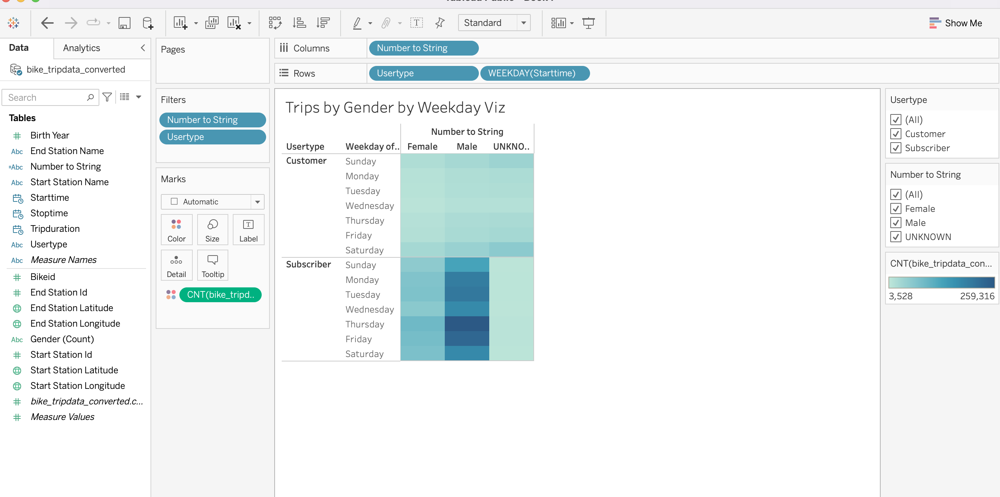

# bikesharing

## Overview of the Project 

The purpose of the this analysis is to create a proposal that supports  investors to support a bike sharing program in Des Moines,Iowa. 

In Initial analsyis, we were able to create visualizations to see average biking durations trends and the relationships between gender and popular times .

In the updated analysis, we were able to show the length of time that bikes are checked out for all rides and genders, Show he number of bike trips for all rides and genders for each hour of each day of the week, show the number of bike trips for each type of user and gender for each day of the week. 

## Results 
The results of the visualization  are shown below .

Click here to view the dashboard on Tableau: [NYC Citi Bike Sharing Analysis Dashboard](https://public.tableau.com/app/profile/swathy3617/viz/NYCCitiBikeSharingServices/NYCCitiBikeSharingAnalysis?publish=yes)

## Summary 

As per the analysis,we can say that many of the users may not be tourists instead they are work commuters based on the peak time riding analysis. Additionally, majority of the users were male riders based on gender v/s ridiing analsyis .For the Des Moines ride-sharing program, it would be be helpful if the stations were to be set up within 10minutes of biking distance as places tends to be father away in suburbs compared to large cities like NYC. 
